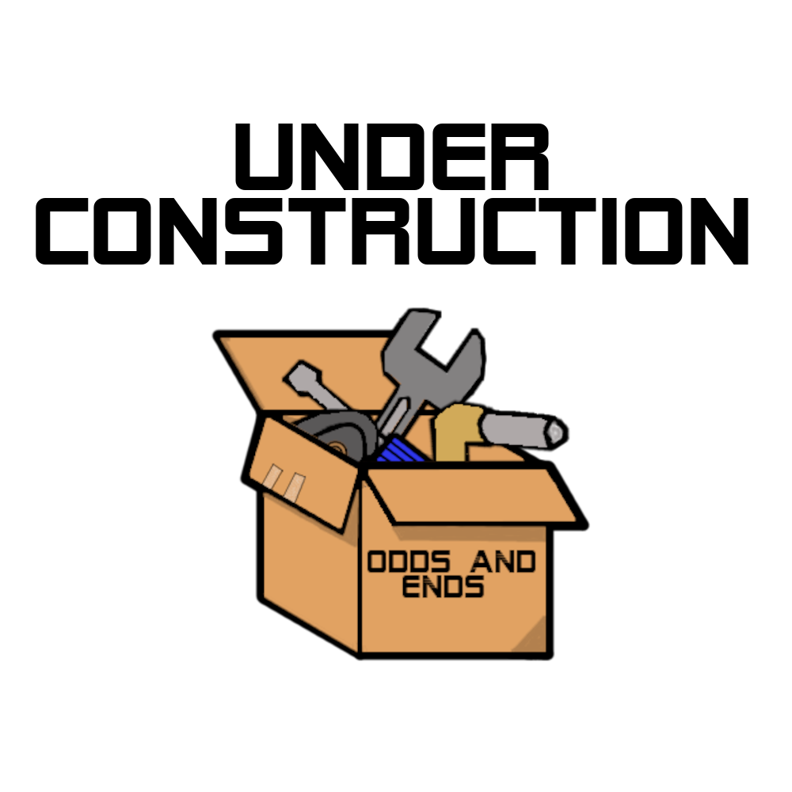

# [About Me](#ab)

Hello, my name is Maxwell Palen Anderson. 

I am a Mechanical Engineering Masters student at the University of Colorado Boulder, who is expecting to graduate in May 2023. I have been developing my engineering knowledge ever since my freshman year of high school when I joined the robotics club. That experience&mdash;and the lessons that it taught me&mdash;sparked a passion for building robotic systems, designing components, and working to solve problems.

As a STEM focused student who loved social studies and the humanities, I have grown into an engineer who is concerned about the human experience and who always considers the end user in mind. In my mind, there is no reason for engineers to do the work we do if no one can use what we make. Engaging in _human-centered engineering_ is how I hope to make an impact and how I wish to give back to my community.

In college (and even in high school), I have worked on many projects that I am proud of. This website serves as an archive of each project and describes why the project was important to me and what I learned from it.

I hope that you enjoy your time here! 

-Max

# [Resume](#res)

* [Maxwell Anderson's Resume](resume.html)

# [Publications](#pub)

* Co-Author on a paper that has been published in IEEE T-RO. 

  *Sundaram V., Ly K., Johnson B., Naris M., Anderson M., Humbert S., Correll N., and Rentschler M., ["Embedded Magnetic Sensing for Feedback Control of Soft HASEL Actuators"](https://ieeexplore.ieee.org/document/9882180) in IEEE Transactions on Robotics, 2022.*
  
  I earned the co-authorship on the paper from the work that is described in the two project entries: "Linear Displacement to Magnetic Field Strength Correlation Platform," and "Platform for Calibrating Magnetometers in Dynamic Environments."

# [Projects](#proj)

<!--[Evaluating Monin-Obukhov Simularity Theory](./projects/Monin_Obukhov.html)-->
<!--[Autonomous Robot that plays "Rocket League"](./projects/Rocket_League_Bot.html)-->
<!--[Linear Discplacement to Magnetic Field Strength Correlation Platform](./projects/Linear_Displacement_Correlation_Platform.html)-->
<!--[Dynamic Statue - Marble Machine](./projects/Marble_Machine.html)-->
<!--[Platform for Calibrating Magnetometers in Dynamic Environments](./projects/Calibrate_Magnetometers.html)-->
<!--[Novel Flexible Tether for Robotic Capsule Endoscope](./projects/RCE_Tether.html)-->
<!--[3D Model of a Larin Vice](./projects/Larin_Vice.html)-->
<!--[Pokemon themed Pinball Machine](./projects/Pinball.html)-->

| Project Title | Brief Project Description | Project Time Span |
|:-------------:|:--------------------------|:--------------:|
|[Soft Robot for Surgical Innovations](./projects/Soft_Robot_for_Surgical_Innovations.html)| For my senior design project, my team and I worked for three clients from Medtronic to learn about the current state of soft robotics, and develop our own soft robot for future use in bronchoscopy| 2021 - 2022 |
| <a class="wip" href="#"> Evaluating Monin-Obukhov Similarity Theory  </a> | Developed Matlab scripts and functions to calculate the statistics required to evaluate Monin-Obukhov Similarity Theory from years worth of collected atmospheric data.| 2021 - 2022 |
|<a class="wip" href="#"> Autonomous Robot that plays "Rocket League"  </a>| My team and I created an autonomous robot to play a game of "Rocket League" against other autonomus robots.| 2021 |
|<a class="wip" href="#"> Linear Displacement to Magnetic Field Strength Correlation Platform  </a>| Designed, manufactured, assembled and used a novel platform to gathering data used to correlate the linear displacement of a new soft robotic actuator to a magnetic field strength.| 2020 - 2021 |
|<a class="wip" href="#"> Dynamic Statue - Marble Machine  </a>| For my component design class, my team and I designed and fabricated a marble machine that utilized a CAM driven escalator.| 2021 |
|<a class="wip" href="#"> Platform for Calibrating Magnetometers in Dynamic Environments  </a>|Designed and fabricated a cheap, portable, and easy to use platform for the calibration of 3 axis magnetometers in new and varied environments.| 2020 |
|<a class="wip" href="#"> Novel Flexible Tether for Robotic Capsule Endoscope  </a>| Developed a novel tether for a new surgical robot that was thin, flexible, and had an interior concentric channel for tooling or irrigation.| 2019 - 2020 |
|<a class="wip" href="#"> 3D Model of a Larin Vice  </a>| For my intro to 3D modeling class, I fully disassembled, measured, and CADed my grandfather's Larin Vice. Model recreates the form and function of the vice.| 2019 |
|["Button Bop!" a Hand-Eye Coordination Game](./projects/Button_Bop.html)| For my freshman projects class, my team and I made a game for Ryan Elementary School's Special Education Program for autistic and other special needs students.| 2018 |
|<a class="wip" href="#"> Pokemon-Themed Pinball Machine  </a>| Created a Pokemon-themed working pinball machine from laser cut and 3D printed components. For my efforts I won the _Silver Key Artistry Award_ in Architetural and Industrial design.| 2016-2017 |
|[Pneumatic Wings](./projects/Beauty_and_Beast_Wings.html)| I made a set of pneumatic wings as a prop in my high school's production of _Beauty and the Beast_.| 2016 |
