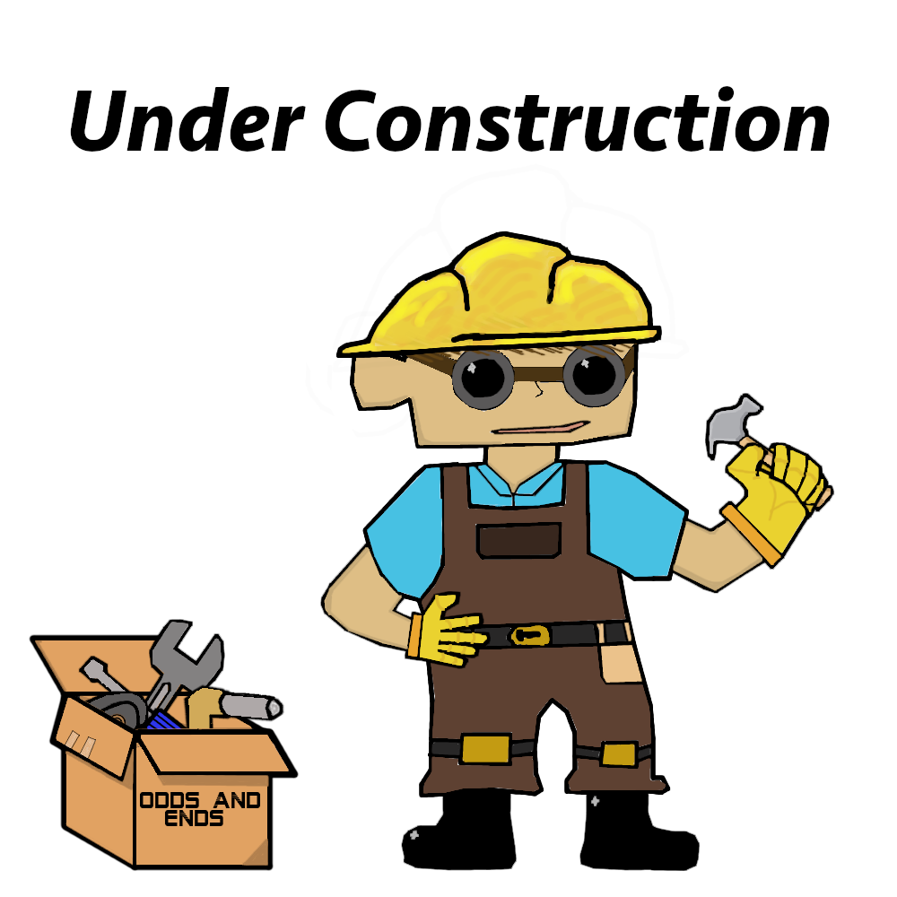

# About Me:

Hello, my name is Maxwell Palen Anderson. 

I am a Mechanical Engineering Senior in my final months of my undergraduate degree. I have been developing my engineering knowledge ever since my freshman year of high school when I joined the robotics club. That experience&mdash;and the lessons that it taught me&mdash;sparked a passion for building robotic systems, designing components, and working to solve problems.

As a STEM focused student who loved social studies and the humanities, I have grown into an engineer who is concerned about the human experience and who always considers the end user in mind. In my mind, there is no reason for engineers to do the work that we do, if no one can use what we make. Human-centered engineering is how I hope to make an impact and how I wish to give back to my community.

In college, I have worked on many projects and I am proud of what I have achieved after investing a lot of time and effort in each of them. This website serves as an archive of each project and describes why the project was important to me and what I learned from it. 

I hope that you enjoy your time here!

-Max

# Resume:

* [Maxwell Anderson's Resume](resume.html)

# Projects:

| Project Title | Brief Project Description | Project Time Span |
|:-------------:|:--------------------------|:--------------:|
|[Soft Robot for Surgical Innovations](./projects/Soft_Robot_for_Surgical_Innovations.html)| For my senior design project, my team and I worked for three clients from Medtronic to learn about the current state of soft robotics, and develop our own soft robot for future use in bronchoscopy| 2021 - 2022 |
|<!--[Evaluating Monin-Obukhov Simularity Theory](./projects/Monin_Obukhov.html)-->Evaluating Monin-Obukhov Simularity Theory| Developed Matlab scripts and functions to calculate the statistics required to evaluate Monin-Obukhov Simularity Theory from years worth of collected atmospheric data.| 2021 - 2022 |
|<!--[Autonomous Robot that plays "Rocket League"](./projects/Rocket_League_Bot.html)-->Autonomous Robot that plays "Rocket League"| My team and I created an autonomous robot to play a game of "Rocket Leage" against other autonomus robots.| 2021 |
|<!--[Linear Discplacement to Magnetic field strength Correlation Platform](./projects/Linear_Displacement_Correlation_Platform.html)-->Linear Discplacement to Magnetic field strength Correlation Platform| Designed, manufactured, asseblemed and used a novel platform to gathering data used to correlate the linear displacement of a new soft robotic actuator to a magnetic field strength.| 2020 - 2021 |
|<!--[Dynamic Statue - Marble Machine](./projects/Marble_Machine.html)-->Dynamic Statue - Marble Machine| For my component design class, my team and I designed and fabricated a marble machine that utalized a CAM driven escalator.| 2021 |
|<!--[Platform for Calibrating Magnetometers in Dynamic Environments](./projects/Calibrate_Magnetometers.html)-->Platform for Calibrating Magnetometers in Dynamic Environments|Designed and fabricated a cheap, portable, and easy to us platform for the calibration of 3 axis magnetometers in new and varied environments.| 2020 |
|<!--[Novel Flexible Tether for Robotic Capsule Endoscope](./projects/RCE_Tether.html)-->Novel Flexible Tether for Robotic Capsule Endoscope| Developed a novel tether for a new surgical robot that was thin, flexible, and had an interior concentric channel for tooling, or irrigation.| 2019 - 2020 |
|<!--[3D Model of a Larin Vice](./projects/Larin_Vice.html)-->3D Model of a Larin Vice| For my intro to 3D modeling class, I fully disassembled, measured, and CADed my grandfather's Larin Vice. Model recreates the form and function of the vice.| 2019 |
|["Button Bop!" a hand-Eye Coordination Game](./projects/Button_Bop.html)| For my freshman projects class, my team and I made a game for Ryan Elementary School's Special Education Program for autistic and other special needs students.| 2018 |
|<!--[Pokemon themed Pinball Machine](./projects/Pinball.html)-->

Pokemon themed Pinball Machine

| Created a Pokemon themed working pinball machine out of laser cut and 3D printed components. For my efforts I won the silver key artistry award in architetural and industrial design.| 2016-2017 |
|[Pneumatic Wings](./projects/Beauty_and_Beast_Wings.html)| I made a set of Pneumatic Wings as a prop in my Highschool's production of "Beauty and the Beast".| 2016 |

Test Project: [Test.wip](./projects/projectExample.html)

<!--  -->

    
Pokemon themed Pinball Machine

    

# Publications

* Co-Author on a paper that has been published in IEEE T-RO. 

  Citation:  
  *Sundaram V., Ly K., Johnson B., Naris M., Anderson M., Humbert S., Correll N., and Rentschler M., ["Embedded Magnetic Sensing for Feedback Control of Soft HASEL Actuators"](https://ieeexplore.ieee.org/document/9882180) in IEEE Transactions on Robotics, 2022.*
  
  I earned the co-authorship on the paper from the work that is described in the two project entries: "Linear Discplacement to Magnetic field strength Correlation Platform", and "Platform for Calibrating Magnetometers in Dynamic Environments"

  
