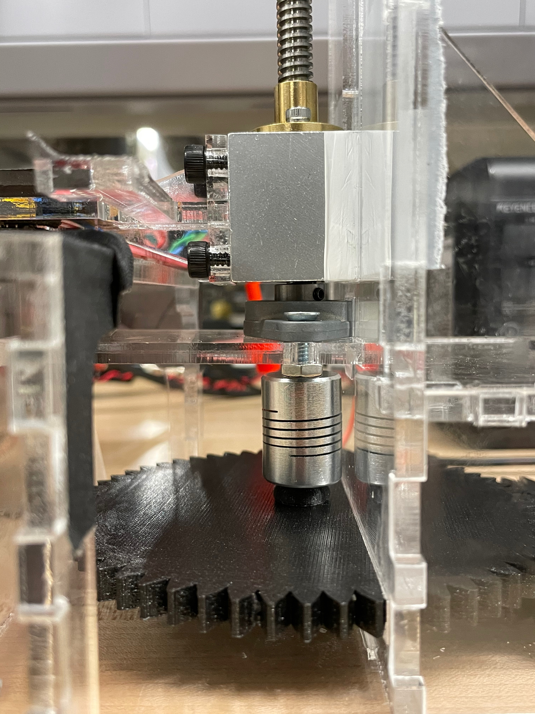

# Testing

This is a test to create the first standalone page on my website.

<video class="tab" controls>Your browser does not support the &lt;video&gt; tag.
  <source src="/jargon/m/computer-hope.mp4"/>
</video>

<model-viewer id="reveal" loading="eager" camera-controls auto-rotate src="../models/Astronaut.glb" alt="A 3D model of a shishkebab" shadow-intensity="1" width="890px" height="800px"></model-viewer>
