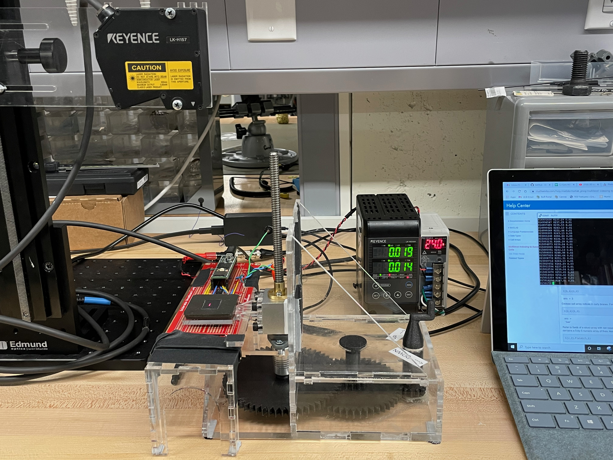

# Testing

This is a test to create the first standalone page on my website.

<iframe width="560" height="315" src="https://www.youtube.com/embed/TlRqJDQsj18" title="YouTube video player" frameborder="0" allow="accelerometer; autoplay; clipboard-write; encrypted-media; gyroscope; picture-in-picture" allowfullscreen></iframe>

<model-viewer id="reveal" loading="eager" camera-controls auto-rotate src="../models/Astronaut.glb" alt="A 3D model of a shishkebab" shadow-intensity="1" width="890px" height="800px"></model-viewer>
